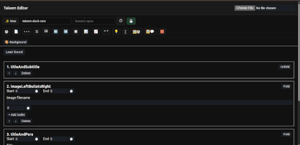
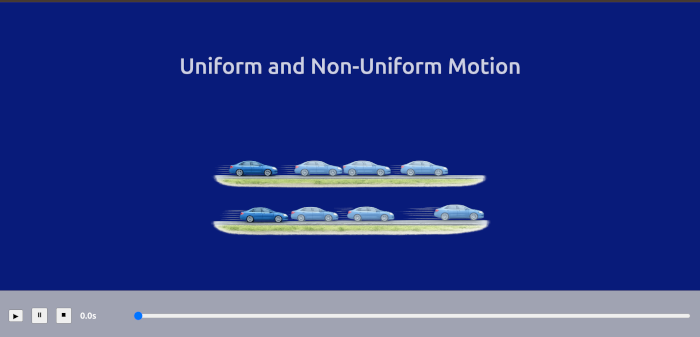

# Taleem Editor

Taleem Editor and Player are maintained by the team behind taleem.help and are available free of cost for teachers, students, and educationists.

Create, share, and present structured lessons in minutes — with no accounts, no hosting, and no data storage.

Your presentations live with you. They are simple files that can be saved, shared, and opened anywhere.

---

---

## ✏️ Editor — Create Structured Lessons

The Editor is where lessons are created.

It is designed to be calm, structured, and focused.

### 🧰 Toolbar Overview

The toolbar allows you to:

• ➕ Create a new lesson  
• 📝 Add different slide types  
• 🖼️ Insert images  
• 📐 Add equations  
• 🎯 Control slide timing  
• 🎵 Attach sound (optional)  
• 💾 Save your lesson file  

Each slide type has a clear purpose — titles, text, image-based explanations, comparison layouts, and structured reasoning slides.

Slides are built step by step.  
You control the order.  
You control the pacing.  

When finished, simply save your lesson as a file.

---

## ▶️ Player — Present with Clarity

The Player is built for calm, controlled presentation.

### 🎬 How It Works

• 📂 Open your saved lesson file  
• ▶️ Press play  
• ⏸ Pause when needed  
• ⏹ Stop and restart  
• 🎚 Use the timeline to control progress  

Content appears in structured steps — not all at once.  
This allows teachers to explain clearly and students to follow comfortably.

The Player keeps focus on learning — not on interface complexity.

---

## 🌍 Who It Is For

Taleem Editor is designed for:

• Classroom teachers  
• Tutors and instructors  
• Students preparing presentations  
• Academic and training institutions  

It emphasizes structure, clarity, and calm pacing — so teaching stays central.

---

## 🔒 Why It Is Different

Taleem Editor does not require:

• User accounts  
• Cloud storage  
• Subscriptions  
• Complex installation  

There is no platform dependency.  
Your work remains fully in your control.

---

## 🚀 Access

The application is deployed and updated automatically.

Open it and begin creating.

---

## About

Taleem Editor is supported and maintained as part of the educational efforts of taleem.help.

It exists to make structured teaching tools freely accessible to educators everywhere.
